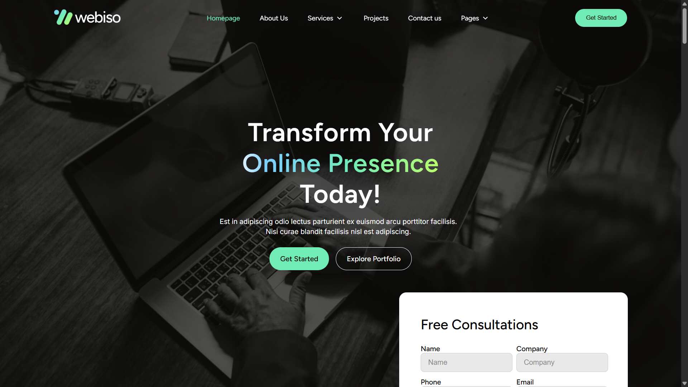

# Webiso - Digital Agency Website

A modern, fully responsive, and animated website for a digital agency, designed to deliver an engaging user experience. Built using the **MERN stack** with smooth, eye-catching animations powered by **Framer Motion**.

## 🎯 Goal of the Project

The goal of this project is to build a real-world, production-ready digital agency website that combines aesthetic UI, smooth animations, and backend functionality. This project also serves as a learning resource for building full-stack applications using the **MERN stack**, and implementing engaging animations using **Framer Motion**.

---

## ⚙️ Process of the Project

1.  **Planning & Design**
 - Defined the structure and layout for a modern agency website.
 - Designed responsive, interactive UI components.
2.  **Frontend Development**
 - Built scalable and reusable components with **ReactJS**.
 - Integrated **Framer Motion** for smooth, appealing animations.
 - Ensured responsiveness across all devices.
3.  **Backend Development**
 - Set up an **ExpressJS** server to handle API requests.
 - Connected to **MongoDB** for storing and managing user data.
4.  **Testing & Optimization**
 - Tested across multiple devices and browsers.
 - Optimized performance and ensured fluid animations.
5.  **Deployment & Documentation**
 - Prepared the project for deployment.
 - Added clear setup instructions for easy local development.

---

## 💡 Features

✅ **Modern Animated UI**
- Smooth, interactive animations using **Framer Motion**.
- Engaging transitions and hover effects.

✅ **Fully Responsive Design**
- Works seamlessly on mobile, tablet, and desktop devices.
- Ensures consistent user experience across screen sizes.

✅ **Reusable & Scalable Frontend**
- Built with **ReactJS**.
- Clean, modular component structure for easy maintenance.

✅ **Backend Integration**
- Robust API using **ExpressJS**.
- User data management with **MongoDB**.
- Easily extendable backend structure.

✅ **Ideal Learning Resource**
- Perfect project to learn frontend animations with **Framer Motion**.
- Full-stack implementation with practical real-world structure.

✅ **Open Source & Contribution Friendly**
- Well-organized codebase.
- Open to contributions and suggestions.

---

## 🛠 Technologies Used

-  **ReactJS** — Scalable frontend components

-  **Framer Motion** — Smooth, modern animations

-  **ExpressJS** — Backend server for handling API requests

-  **MongoDB** — NoSQL database for storing user data

-  **Node.js** — Backend runtime environment

---

## 🚀 Getting Started

### 📦 Project Structure

```
webiso-app
│
├── webiso-frontend/ # ReactJS frontend with Framer Motion animations
│
└── webiso-backend/ # ExpressJS backend with MongoDB integration

```

### To Run Backend

```bash

cd  webiso-backend
npm  install  # Install dependencies

```

Add your **MongoDB URL & PORT** in the `.env` file:
  
```env

MONGO_URL=your_mongodb_connection_string
PORT=3000

```

```bash

npm  run  dev  # Run the backend server

```

### To Run Frontend


```bash

cd  webiso-frontend
npm  install  # Install dependencies
npm  run  dev  # Run the application

```

The website will be available at [http://localhost:5173](http://localhost:5173).
  
---

  
## 💻 Implementation


[](https://www.linkedin.com/feed/update/urn:li:ugcPost:7341740944393703426)

Checkout live here: [https://webiso-app.vercel.app](https://webiso-app.vercel.app/)
  

---
  

## 🙋‍♂️ Author
  

**Darshan Jethava**

Full Stack Developer | AI Enthusiast

[Portfolio](https://darshanjethava.vercel.app) | [LinkedIn](https://www.linkedin.com/in/darshan-jethava) | [GitHub](https://github.com/mr-dj06)  

---


## 🤝 Contributions

Feel free to contribute, suggest improvements, or open issues.

A ⭐ on the repository would be highly appreciated!


---


## 📄 License

This project is open-source and available for learning and contribution.
